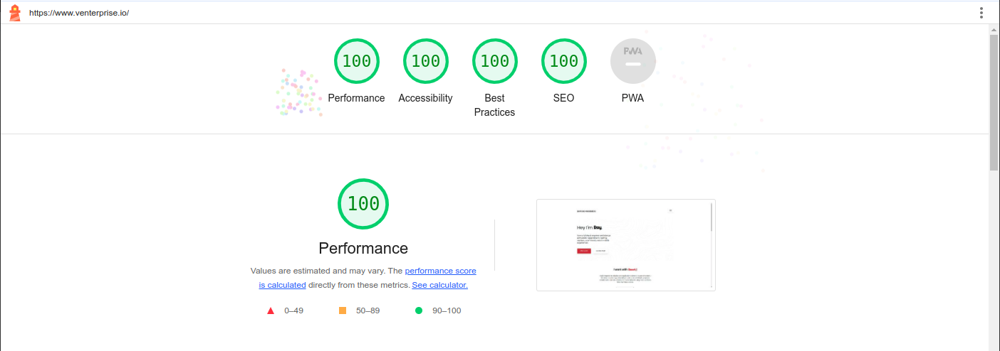

# 🚀 Portfolio Website

> **Live Demo:** [https://venterprise.io](https://venterprise.io)

A modern, responsive portfolio website built with cutting-edge technologies and best practices.

## ✨ Features

- 🎨 **Modern Design** - Clean, responsive UI with beautiful animations
- ⚡ **Performance Optimized** - Built with Next.js 13 for optimal speed
- 🔒 **Type Safe** - Full TypeScript implementation
- 🧪 **Tested** - Comprehensive E2E testing with Cypress
- 🚀 **Deployed** - Automated deployment via Vercel

## 🛠️ Tech Stack

| Category | Technology |
|----------|------------|
| **Framework** |  |
| **Language** |  |
| **UI Library** |  |
| **Icons** |  |
| **Linting** |  |

## 🚀 Deployment & CI/CD

| Service | Status |
|---------|--------|
| **Deployment** |  |
| **CI/CD** |  |
| **Testing** |  |

## 📊 Performance Metrics

<div align="center">
  
</div>

## 🎯 Roadmap

### 🔄 In Progress
- [ ] **Phosphor Icons Fix** - Wait for Next.js types compatibility
- [ ] **Cypress Configuration** - Remove ts-node workaround when fixed

### ✅ Completed
- [x] **Portfolio Website** - Modern, responsive design
- [x] **Performance Optimization** - Lighthouse score optimization
- [x] **TypeScript Integration** - Full type safety
- [x] **E2E Testing** - Cypress test suite
- [x] **Automated Deployment** - Vercel integration

## 🚀 Quick Start

```bash
# Clone the repository
git clone https://github.com/yourusername/portfolio.git

# Install dependencies
npm install

# Run development server
npm run dev

# Run tests
npm run test:e2e

# Build for production
npm run build
```

## 📝 License

This project is open source and available under the [MIT License](LICENSE).